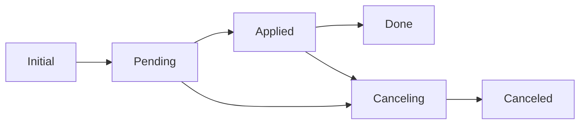

# 💰 Two-Phase Commit Protocol for MongoDB


**A robust implementation of the Two-Phase Commit protocol for distributed transactions in MongoDB without requiring replica sets**

*Built for learning distributed systems and transaction management*

---

## 📖 Table of Contents

- [🌟 Features](#-features)
- [🤔 What is Two-Phase Commit?](#-what-is-two-phase-commit)
- [🎯 Why This Project?](#-why-this-project)
- [🏗️ Architecture](#️-architecture)
- [🚀 Getting Started](#-getting-started)
- [💻 Usage](#-usage)
- [📚 API Reference](#-api-reference)
- [🔧 Configuration](#-configuration)
- [🛠️ Tech Stack](#️-tech-stack)
- [📁 Project Structure](#-project-structure)
- [🧪 Testing](#-testing)
- [🔮 Future Enhancements](#-future-enhancements)
- [🤝 Contributing](#-contributing)
- [📝 License](#-license)

---

## 🌟 Features

- ✅ **No Replica Set Required** - Works with standalone MongoDB
- ✅ **ACID Guarantees** - Atomicity, Consistency, Isolation, Durability
- ✅ **Automatic Rollback** - Handles failures gracefully
- ✅ **Stuck Transaction Recovery** - Recovers from system crashes
- ✅ **Balance Tracking** - Real-time available balance calculation
- ✅ **Pending Transaction Management** - Track in-progress transfers
- ✅ **Reusable Module** - Easy integration into any project
- ✅ **Production Ready** - Comprehensive error handling

---

## 🤔 What is Two-Phase Commit?

The **Two-Phase Commit (2PC)** protocol is a distributed algorithm that coordinates all processes participating in a distributed atomic transaction. It ensures that either all operations succeed or all fail together.

### 🔄 Transaction Flow



| State | Description | Actions |
|-------|-------------|---------|
| **Initial** | Transaction created | Ready to start |
| **Pending** | Accounts locked | Funds reserved |
| **Applied** | Transfer executed | Balance updated |
| **Done** | Transaction complete | Accounts unlocked |
| **Canceling** | Rolling back | Reversing changes |
| **Canceled** | Rollback complete | Transaction failed |

---

## 🎯 Why This Project?

MongoDB's native transactions require a **replica set** configuration, which can be complex for development and small-scale deployments. This project implements a **manual two-phase commit** that:

- 📝 **Educational** - Learn distributed transaction patterns
- 🚀 **Practical** - Works on standalone MongoDB
- 💡 **Production-Ready** - Can be used in real applications
- 🔍 **Transparent** - Full control over transaction lifecycle

### 🆚 Comparison

| Feature | Native Transactions | This Implementation |
|---------|---------------------|---------------------|
| Replica Set Required | ✅ Yes | ❌ No |
| Automatic Rollback | ✅ Built-in | ✅ Custom |
| Performance | ⚡ Fast | 🐢 Moderate |
| Complexity | 😊 Simple API | 🤔 Manual Steps |
| Best For | Production (large scale) | Learning & Small apps |

---

## 🏗️ Architecture

### 🗄️ Database Schema

```javascript
// Account Schema
{
  _id: ObjectId,
  firstName: String,
  lastName: String,
  balance: Number,
  pendingTransactions: [ObjectId]  // Locked transactions
}

// Transaction Schema
{
  _id: ObjectId,
  source: ObjectId,           // Source account
  destination: ObjectId,      // Destination account
  value: Number,              // Transfer amount
  state: String,              // Transaction state
  lastModified: Date          // Last state change
}
```

### 📊 Transaction Lifecycle

```
┌─────────────────────────────────────────────────────────────┐
│                     PHASE 1: PREPARE                        │
├─────────────────────────────────────────────────────────────┤
│ 1. Set transaction state to "pending"                      │
│ 2. Add transaction ID to both accounts' pending list       │
│ 3. Lock accounts for this transaction                      │
└─────────────────────────────────────────────────────────────┘
                            ↓
┌─────────────────────────────────────────────────────────────┐
│                     PHASE 2: COMMIT                         │
├─────────────────────────────────────────────────────────────┤
│ 1. Deduct amount from source account (check balance)       │
│ 2. Add amount to destination account                       │
│ 3. Set transaction state to "applied"                      │
└─────────────────────────────────────────────────────────────┘
                            ↓
┌─────────────────────────────────────────────────────────────┐
│                     PHASE 3: CLEANUP                        │
├─────────────────────────────────────────────────────────────┤
│ 1. Remove transaction from pending lists                   │
│ 2. Set transaction state to "done"                         │
│ 3. Unlock accounts                                         │
└─────────────────────────────────────────────────────────────┘
```

---

## 🚀 Getting Started

### 📋 Prerequisites

- Node.js >= 14.x
- MongoDB >= 4.0
- npm or yarn

### 🔧 Installation

```bash
# Clone the repository
git clone https://github.com/yourusername/two-phase-commit.git
cd two-phase-commit

# Install dependencies
npm install
```

### 🗃️ Database Setup

```bash
# Start MongoDB (no replica set needed!)
mongod --dbpath /path/to/your/data

# Or use Docker
docker run -d -p 27017:27017 --name mongodb mongo:7
```

### ▶️ Run the Application

```bash
# Run the example
node app.js

# Or with nodemon for development
npm run dev
```

---

## 💻 Usage

### 🎬 Basic Example

```javascript
const mongoose = require("mongoose");
const { executeTransfer } = require("./two-phase-commit");

// Connect to MongoDB
await mongoose.connect("mongodb://localhost:27017/two-phase-commits");

// Define models
const AccountModel = mongoose.model("Account", accountSchema);
const TransactionModel = mongoose.model("Transactions", transactionSchema);

// Execute transfer
const result = await executeTransfer({
  sourceId: "account1_id",
  destId: "account2_id",
  amount: 500,
  models: { AccountModel, TransactionModel }
});

console.log(result);
// Output: { success: true, transactionId: "...", message: "Transfer completed successfully" }
```

### 🔍 Check Balance with Pending Transactions

```javascript
const { getAccountBalance } = require("./two-phase-commit");

const balance = await getAccountBalance({
  accountId: "account1_id",
  models: { AccountModel, TransactionModel }
});

console.log(balance);
// Output:
// {
//   accountId: "...",
//   balance: 1000,
//   pendingDebit: 200,      // Money being sent
//   pendingCredit: 150,     // Money being received
//   availableBalance: 800,  // Can spend now
//   projectedBalance: 950   // After pending clears
// }
```

### 🔄 Recover Stuck Transactions

```javascript
const { recoverStuckTransactions } = require("./two-phase-commit");

// Run periodically (e.g., cron job)
const result = await recoverStuckTransactions({
  models: { AccountModel, TransactionModel },
  timeoutMinutes: 5
});

console.log(`Recovered: ${result.recovered}, Failed: ${result.failed}`);
```

---

## 📚 API Reference

### 🔝 High-Level API (Recommended)

#### `executeTransfer(params)`

Execute a complete fund transfer.

**Parameters:**
```javascript
{
  sourceId: String,      // Source account ID (required)
  destId: String,        // Destination account ID (required)
  amount: Number,        // Transfer amount (required, > 0)
  models: {
    AccountModel: Model,      // Mongoose Account model (required)
    TransactionModel: Model   // Mongoose Transaction model (required)
  }
}
```

**Returns:**
```javascript
{
  success: Boolean,
  transactionId: String,
  message: String
}
```

**Throws:** Error if validation fails or insufficient balance

---

#### `getAccountBalance(params)`

Get account balance including pending transactions.

**Parameters:**
```javascript
{
  accountId: String,     // Account ID (required)
  models: { AccountModel, TransactionModel }
}
```

**Returns:**
```javascript
{
  accountId: String,
  balance: Number,              // Current balance
  pendingDebit: Number,         // Outgoing pending
  pendingCredit: Number,        // Incoming pending
  availableBalance: Number,     // Balance - pendingDebit
  projectedBalance: Number      // Balance - pendingDebit + pendingCredit
}
```

---

#### `recoverStuckTransactions(params)`

Recover transactions stuck in pending/applied state.

**Parameters:**
```javascript
{
  models: { AccountModel, TransactionModel },
  timeoutMinutes: Number  // Default: 5 minutes
}
```

**Returns:**
```javascript
{
  recovered: Number,     // Successfully recovered
  failed: Number,        // Failed to recover
  details: [            // Array of results
    { transactionId: String, success: Boolean, error: String }
  ]
}
```

---

### 🔧 Low-Level API (Advanced)

For fine-grained control over transaction steps:

- `startTransaction(params)` - Phase 1: Lock accounts
- `applyTransaction(params)` - Phase 2: Execute transfer
- `completeTransaction(params)` - Phase 3: Cleanup
- `cancelTransaction(params)` - Rollback transaction

---

## 🔧 Configuration

### 🗂️ Models Setup

```javascript
// models.js
const mongoose = require("mongoose");

const accountSchema = new mongoose.Schema({
  firstName: String,
  lastName: String,
  balance: { type: Number, default: 0 },
  pendingTransactions: [{ type: mongoose.Schema.Types.ObjectId, ref: "Transaction" }]
});

const transactionSchema = new mongoose.Schema({
  source: { type: mongoose.Schema.Types.ObjectId, ref: "Account", required: true },
  destination: { type: mongoose.Schema.Types.ObjectId, ref: "Account", required: true },
  value: { type: Number, required: true, min: 0 },
  state: {
    type: String,
    enum: ["initial", "pending", "applied", "done", "canceling", "canceled"],
    default: "initial"
  },
  lastModified: { type: Date, default: Date.now }
});

module.exports = {
  AccountModel: mongoose.model("Account", accountSchema),
  TransactionModel: mongoose.model("Transaction", transactionSchema)
};
```

---

## 🛠️ Tech Stack

| Technology | Purpose | Version |
|------------|---------|---------|
| **Node.js** | Runtime | >= 14.x |
| **MongoDB** | Database | >= 4.0 |
| **Mongoose** | ODM | ^8.0.0 |
| **JavaScript** | Language | ES6+ |

---

## 📁 Project Structure

```
two-phase-commit/
├── 📄 app.js                    # Main application
├── 📄 two-phase-commit.js       # Core 2PC implementation
├── 📄 models.js                 # Mongoose schemas
├── 📄 package.json              # Dependencies
├── 📄 README.md                 # This file
├── 📁 examples/                 # Usage examples
│   ├── basic-transfer.js
│   ├── balance-check.js
│   └── recovery.js
└── 📁 tests/                    # Test files
    └── two-phase-commit.test.js
```

---

## 🧪 Testing

### ✅ Run Tests

```bash
# Install test dependencies
npm install --save-dev jest

# Run tests
npm test
```

### 🧪 Manual Testing Scenarios

#### Test 1: Successful Transfer
```bash
node examples/basic-transfer.js
# Expected: Transfer completes, balances updated
```

#### Test 2: Insufficient Balance
```bash
# Try to transfer more than available
# Expected: Transaction rolls back, error thrown
```

#### Test 3: System Crash Recovery
```bash
# Kill process during transaction
# Run recovery script
node examples/recovery.js
# Expected: Stuck transactions canceled
```

---

## 🔮 Future Enhancements

- [ ] **Distributed Locking** - Add distributed lock manager
- [ ] **Saga Pattern** - Implement compensating transactions
- [ ] **Event Sourcing** - Track all state changes
- [ ] **Monitoring Dashboard** - Real-time transaction monitoring
- [ ] **Performance Metrics** - Transaction throughput tracking
- [ ] **Multi-currency Support** - Handle different currencies
- [ ] **Transaction Limits** - Daily/monthly transfer limits
- [ ] **Audit Log** - Complete transaction history
- [ ] **Retry Mechanism** - Automatic retry on failures
- [ ] **GraphQL API** - Alternative API interface

---

## 🤝 Contributing

Contributions are welcome! Please follow these steps:

1. 🍴 Fork the repository
2. 🌿 Create a feature branch (`git checkout -b feature/AmazingFeature`)
3. 💾 Commit your changes (`git commit -m 'Add some AmazingFeature'`)
4. 📤 Push to the branch (`git push origin feature/AmazingFeature`)
5. 🔃 Open a Pull Request

### 📝 Coding Standards

- Use ES6+ syntax
- Add JSDoc comments for functions
- Write tests for new features
- Follow existing code style

---

## 📝 License


---

## 👨‍💻 Author

**Your Name**

- GitHub: [@yourusername](https://github.com/amirazadehranjbar)
- LinkedIn: [Your Name](https://www.linkedin.com/in/amir-azadeh-ranjbar-2a1ba5205/?lipi=urn%3Ali%3Apage%3Ad_flagship3_feed%3BteY9siD9Roat%2FjEQ3kf2UQ%3D%3D)
- Email: amirazadehranjbar@gmail.com

---

## 🙏 Acknowledgments

- Inspired by MongoDB's distributed transaction patterns
- Based on the classic Two-Phase Commit protocol
- Built for learning and educational purposes

---

## 📊 Project Stats


---


### ⭐ Star this repository if you find it helpful!

Made with ❤️ for learning distributed systems

